# 🩺 حالتي | Halati

<p align="center">
  <strong>Smart Health Tracking & AI-Powered Reporting Application</strong>
</p>

<p align="center">
  Track Symptoms • Monitor Health Patterns • Generate Reports • AI-Powered Summaries
</p>

<p align="center">
  <strong>Final Project — Flutter Bootcamp</strong>
</p>

<p align="center">
  Designed & Developed by<br>
  <strong>Salma Alhababi — سلمى الحبابي</strong><br>
  <strong>Buthaina Bin Humaid — بثينة بن حميد</strong>
</p>

---

# 🎬 Halati App Demo

<p align="center">
  
</p>

<p align="center">
  <strong>See Halati in Action 💙</strong>
</p>

<p align="center">
  <sub>
    Explore the complete application experience — from symptom tracking
    to smart health reports and AI-powered summaries.
  </sub>
</p>

<p align="center">
  <a href="halati_demo.mp4">
    <strong>▶️ Watch Full Application Demo</strong>
  </a>
</p>

---

# 💙 About Halati

**Halati (حالتي)** is a smart Arabic health tracking application developed using **Flutter**.

The application helps users record and organize symptoms, review their health history, monitor recurring health patterns, manage medical appointments, and generate structured health reports.

Halati combines **Flutter, Dart, Supabase, Google Gemini AI, REST APIs, PDF generation, and local notifications** to provide a complete and easy-to-use health tracking experience.

> **Medical Disclaimer:** Halati organizes and summarizes user-provided health information. It is not a medical diagnostic system and does not replace professional medical advice, diagnosis, or treatment.

---

# ✨ Key Features

| Feature | Description |
|:---|:---|
| 🩺 **Symptom Tracking** | Record symptoms, severity, location, recurrence, medications, and notes |
| 📚 **Health History** | Review previously recorded symptoms |
| 🔍 **Search & Filtering** | Search and filter health records |
| 📊 **Health Analytics** | Calculate symptom statistics and recurring patterns |
| 🤖 **AI Summary** | Generate Arabic health summaries using Google Gemini |
| 📄 **PDF Reports** | Export structured Arabic health reports |
| 📅 **Appointments** | Save upcoming medical appointments |
| 🔔 **Notifications** | Receive daily health reminders |
| 🔐 **Authentication** | Secure account management using Supabase |
| 👤 **Guest Mode** | Explore public areas without creating an account |
| 🇸🇦 **Arabic RTL** | Arabic-first Right-to-Left interface |
| 📱 **Responsive UI** | Adaptable interface for different screen sizes |

---

# 📱 Application Preview

<p align="center">
  A visual tour of the main screens and features of <strong>Halati</strong>.
</p>

<br>

## 🔐 Authentication

<p align="center">
  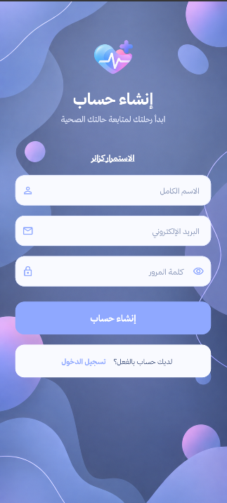
  &nbsp;&nbsp;&nbsp;
  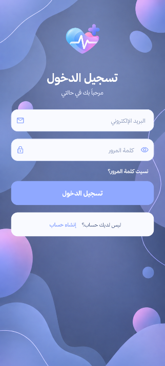
  &nbsp;&nbsp;&nbsp;
  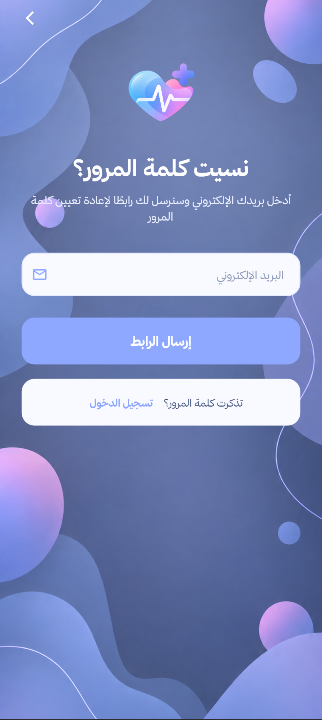
</p>

| Create Account | Login | Password Recovery |
|:---:|:---:|:---:|
| Create a new Halati account | Securely access an existing account | Recover access to the account |

Halati uses **Supabase Authentication** to provide account creation, secure login, password recovery, and authentication session management.

The application also supports **Guest Mode**, allowing visitors to explore available public sections before signing in.

---

## 🏠 Home & Health Tracking

<p align="center">
  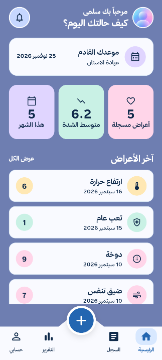
  &nbsp;&nbsp;&nbsp;
  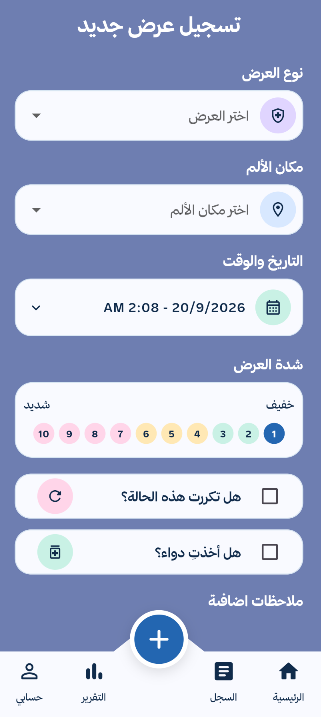
  &nbsp;&nbsp;&nbsp;
  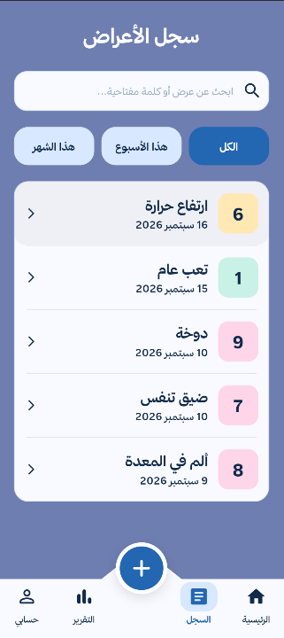
</p>

| Home Dashboard | Add Symptom | Health History |
|:---:|:---:|:---:|
| Health overview and quick access | Record new health information | Review previous health records |

The **Home Dashboard** provides users with a quick overview of their health activity.

It provides access to:

- Upcoming medical appointments
- Symptoms recorded during the month
- Average symptom severity
- Latest recorded symptoms
- Health history
- Health reports
- Notifications
- Profile
- Adding a new symptom

The symptom tracking system allows users to record detailed health information including symptom type, location, severity, recurrence, medications, date, and additional notes.

---

## 📊 Reports, AI & Notifications

<p align="center">
  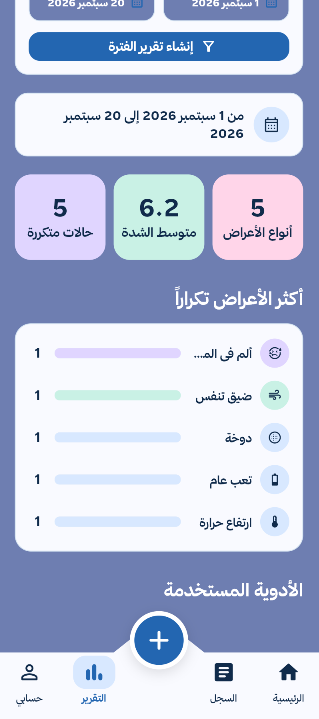
  &nbsp;&nbsp;&nbsp;
  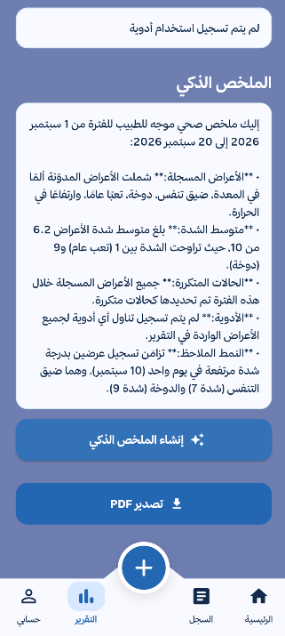
  &nbsp;&nbsp;&nbsp;
  
</p>

| Health Statistics | AI-Powered Summary | Notifications |
|:---:|:---:|:---:|
| Analyze recorded symptoms | Gemini-generated Arabic summary | Daily health reminders |

Halati processes recorded information and automatically generates useful health statistics.

The reporting system can display:

- Number of symptom types
- Average symptom severity
- Number of recurring cases
- Most frequently recorded symptoms
- Number of occurrences
- Medication information
- Selected report period
- AI-generated summary

The notification system also encourages users to consistently record and review their health status.

---

## 📄 PDF Health Reports

<p align="center">
  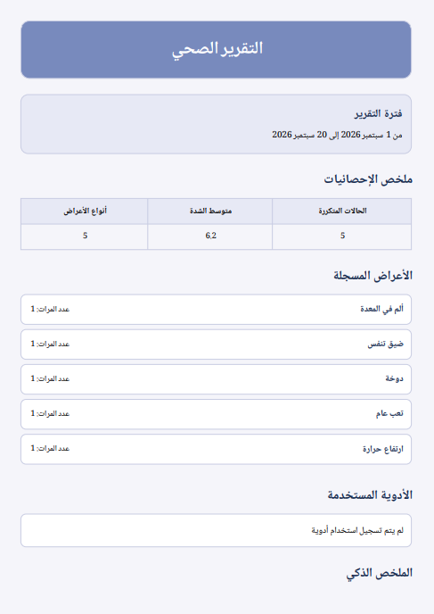
  &nbsp;&nbsp;&nbsp;
  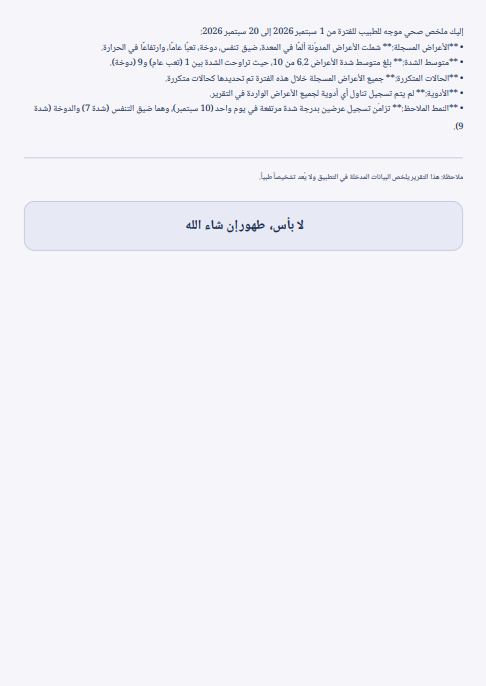
</p>

| PDF Report — Page 1 | PDF Report — Page 2 |
|:---:|:---:|
| Health statistics and symptom information | AI summary, medications and report details |

Halati can dynamically generate a professional Arabic **PDF health report** based on the user's selected reporting period.

The generated report can contain:

- Selected date range
- Health statistics
- Recorded symptoms
- Symptom frequency
- Medication information
- AI-generated Arabic summary
- Medical disclaimer

This gives users an organized document containing the health information they recorded during a selected period.

---

## 👤 Profile, Personal Information & Appointments

<p align="center">
  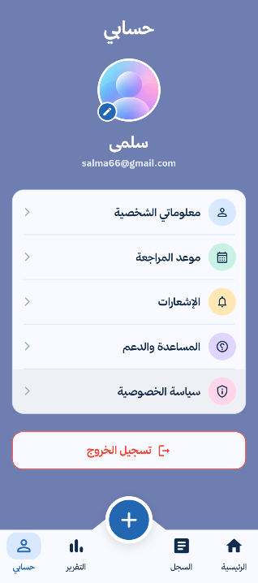
  &nbsp;&nbsp;&nbsp;
  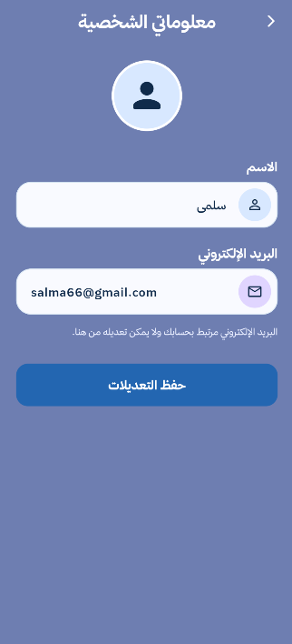
  &nbsp;&nbsp;&nbsp;
  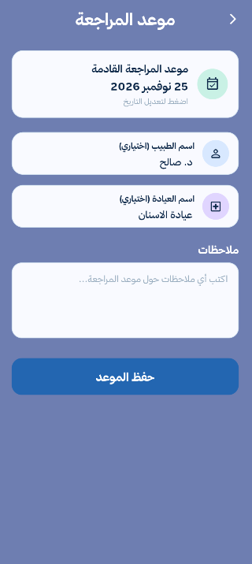
</p>

| Profile | Personal Information | Appointments |
|:---:|:---:|:---:|
| Manage application features | Review account information | Manage medical appointments |

The profile area provides access to personal information, appointments, notifications, support, privacy information, and account management.

Users can save medical appointment information including:

- Appointment date
- Doctor name
- Clinic name
- Additional notes

The upcoming appointment can also be displayed directly on the Home Dashboard.

---

## 💙 Help, Privacy & Account

<p align="center">
  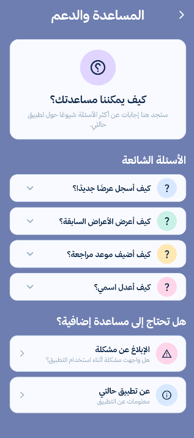
  &nbsp;&nbsp;&nbsp;
  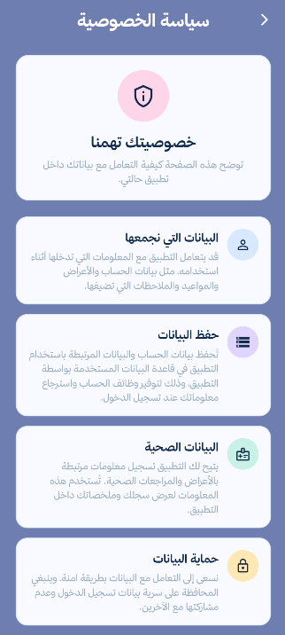
  &nbsp;&nbsp;&nbsp;
  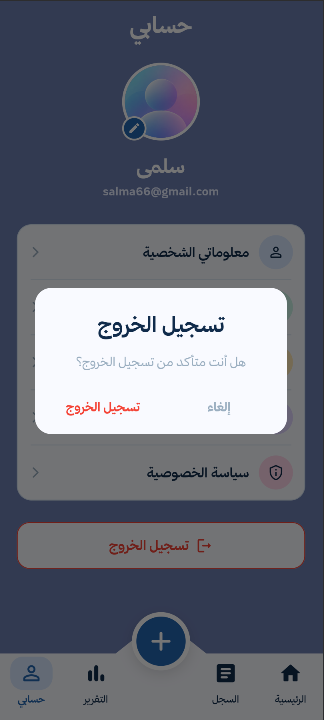
</p>

| Help & Support | Privacy Policy | Account Management |
|:---:|:---:|:---:|
| Application guidance and FAQs | Privacy and data information | Secure account logout |

The **Help & Support** section provides answers to common questions about using Halati.

The **Privacy Policy** section provides information about how user information is handled within the application.

Authenticated users can also securely sign out of their account.

---

# 🩺 Symptom Tracking

Halati provides a structured system for recording health information.

Each symptom record can include:

| Information | Description |
|:---|:---|
| **Symptom** | Name or type of symptom |
| **Location** | Affected body area |
| **Severity** | Severity level from 1–10 |
| **Date** | Date and time of the symptom |
| **Recurrence** | Whether the symptom is recurring |
| **Medication** | Whether medication was taken |
| **Medication Name** | Name of the medication |
| **Notes** | Additional information entered by the user |

Each record is stored in the application's backend and associated with the authenticated user.

The stored information can later be accessed through the user's Health History and Smart Reports.

---

# 📚 Health History

The **Health History** feature provides an organized timeline of previously recorded symptoms.

Users can:

- View recorded symptoms
- Review symptom dates
- Review severity levels
- View medication information
- Read previous notes
- Search health records
- Filter records by time period
- Open individual symptom details

This allows users to maintain an organized record of their health information over time.

---

# 🔍 Search & Filtering

Halati includes search and filtering functionality to make navigating health records easier.

Users can search records using information such as:

- Symptom name
- Symptom location
- Notes
- Medication name

Records can also be filtered according to a selected period.

---

# 📊 Smart Health Reports

One of the main features of Halati is its **Smart Health Reporting System**.

The application processes stored symptom information and automatically calculates useful statistics.

| Statistic | Description |
|:---|:---|
| **Symptom Types** | Number of different symptoms recorded |
| **Average Severity** | Average severity of recorded symptoms |
| **Recurring Cases** | Number of recurring symptoms |
| **Symptom Frequency** | Number of occurrences for each symptom |
| **Medications** | Medications recorded during the selected period |
| **Date Range** | Selected report period |
| **AI Summary** | Gemini-generated Arabic summary |

---

# 📅 Custom Date Range Reports

Users can select a specific reporting period.

```text
From Date
    ↓
To Date
    ↓
Retrieve Health Records
    ↓
Analyze Symptoms
    ↓
Calculate Statistics
    ↓
Generate AI Summary
    ↓
Create Health Report
```

This allows users to create focused reports for specific periods instead of always analyzing their complete health history.

---

# 🤖 AI-Powered Health Summary

Halati integrates **Google Gemini AI** to generate a concise Arabic summary based on health information recorded by the user.

The application prepares structured information including:

- Symptom name
- Symptom location
- Severity
- Recurrence
- Medication usage
- Medication name
- Symptom date
- Notes

The information is sent to the AI model through an HTTP request.

The generated summary can describe:

- Frequently recorded symptoms
- General recorded severity
- Recurring symptoms
- Medication usage
- Patterns supported by recorded information

---

## 🛡️ AI Safety

The AI integration is intentionally designed as a **summarization feature rather than a diagnostic system**.

The AI is instructed to:

- Summarize only the provided information
- Avoid medical diagnosis
- Avoid claiming that the user has a particular disease
- Avoid inventing missing information
- Avoid unsupported conclusions
- Keep the summary concise and professional

The purpose of the AI feature is to organize recorded health information, not replace healthcare professionals.

---

# 📄 PDF Report Generation

Halati uses the **pdf** package to dynamically generate health reports.

The PDF system supports:

- A4 documents
- Dynamic user data
- Arabic text
- Health statistics
- Symptom lists
- Medication information
- AI summaries
- Medical disclaimers

The **printing** package works alongside the PDF package to provide functionality related to generated PDF documents on supported platforms.

---

# 📅 Appointment Management

Halati allows authenticated users to save upcoming medical appointments.

Appointment information can include:

```text
Appointment Date
Doctor Name
Clinic Name
Notes
```

Appointment information is stored in Supabase and associated with the authenticated user.

The nearest upcoming appointment can also be displayed on the application's Home Dashboard.

---

# 🔔 Daily Health Reminders

Halati includes local notification functionality for supported Android environments.

Example notification:

> **حالتي 💙**  
> كيف حالتك اليوم؟

The notification system helps encourage consistent health tracking.

Halati uses:

```text
flutter_local_notifications
timezone
```

for notification initialization and scheduling.

---

# 🔐 Authentication System

Halati uses **Supabase Authentication** for account functionality.

The authentication flow includes:

- User registration
- User login
- Authentication session handling
- Password recovery
- Password reset
- Authentication state monitoring
- Secure logout

Guest Mode is also supported for users who want to explore the application before signing in.

---

# 👤 Guest Mode

Halati includes a dedicated **Guest Mode**.

Guest users can explore public areas of the application without creating an account.

Features that require personal health information remain protected until the user signs in.

This approach allows new users to explore the application while keeping personal health functionality connected to authenticated accounts.

---

# 🛠️ Technology Stack

| Technology / Package | Purpose |
|:---|:---|
| **Flutter** | Cross-platform application development |
| **Dart** | Main programming language |
| **Supabase** | Backend and database |
| **Supabase Authentication** | Authentication and password recovery |
| **Google Gemini API** | AI-generated health summaries |
| **HTTP** | REST API communication |
| **JSON** | Structured API data exchange |
| **pdf** | Dynamic PDF report generation |
| **printing** | PDF handling and export |
| **flutter_dotenv** | Environment configuration |
| **flutter_local_notifications** | Local health notifications |
| **timezone** | Notification scheduling |
| **Git** | Version control |
| **GitHub** | Source code collaboration |
| **VS Code** | Development environment |

---

# 💙 Flutter

**Flutter** is the main framework used to build Halati.

Flutter is responsible for:

- User interface development
- Navigation
- Forms
- Responsive layouts
- User interactions
- Application logic
- Cross-platform development

Using Flutter allows Halati to share a single Dart codebase across supported platforms.

---

# 🎯 Dart

**Dart** is the programming language used throughout the application.

Dart handles:

- Application logic
- Asynchronous operations
- Data processing
- API communication
- JSON processing
- UI behavior
- Database communication
- PDF generation
- Notification scheduling

---

# 🟢 Supabase

**Supabase** provides the backend infrastructure for Halati.

It is used primarily for:

```text
Authentication
      +
Database
```

## Authentication

Supabase Authentication handles:

- Sign up
- Login
- User sessions
- Password recovery
- Authentication events

## Database

The Supabase database stores health-related information entered through the application.

Symptom records can contain information such as:

```text
condition_name
location
severity
is_repeated
took_medicine
medicine_name
symptom_date
notes
```

The application performs database operations including:

- Creating symptom records
- Reading symptom records
- Retrieving health history
- Filtering records by date
- Ordering records
- Generating report datasets

---

# 🌐 REST API Integration

Halati communicates with external services using HTTP-based APIs.

The Dart **http** package handles:

- HTTP requests
- POST requests
- Request headers
- JSON request bodies
- API responses
- Status codes
- Error handling

This is primarily used for communication with the **Google Gemini API**.

---

# 🧠 Google Gemini API

**Google Gemini** provides the artificial intelligence functionality used by Halati.

The general workflow is:

```text
Health Records
      ↓
Flutter Application
      ↓
Prepare Structured Data
      ↓
JSON Encoding
      ↓
HTTP Request
      ↓
Google Gemini API
      ↓
AI-Generated Arabic Summary
      ↓
Health Report
```

This integration demonstrates how generative AI can be incorporated into an application while keeping its role focused on summarizing provided information.

---

# 🔄 JSON Processing

Halati uses JSON when exchanging structured information with external APIs.

Dart provides:

```dart
dart:convert
```

for operations such as:

```dart
jsonEncode()
jsonDecode()
```

JSON is particularly important when communicating with Gemini and processing API responses.

---

# 🇸🇦 Arabic & RTL Support

Halati is designed primarily around an Arabic user experience.

The interface uses:

```dart
TextDirection.rtl
```

where appropriate to provide natural **Right-to-Left (RTL)** content presentation.

Arabic-compatible typography is also used when generating PDF reports.

This ensures Arabic health information is displayed correctly both inside the application and in generated reports.

---

# 🎨 UI/UX Design

Halati follows a consistent visual identity designed around a calm and friendly healthcare experience.

The interface uses:

- Soft blue backgrounds
- White rounded cards
- Dark navy typography
- Pastel accent colors
- Consistent spacing
- Custom Arabic typography
- Clear visual hierarchy
- Reusable navigation components
- Responsive layouts

The design aims to make health information simple, organized, and easy to navigate.

---

# 📱 Responsive Design

Halati uses responsive screen dimensions to adapt interface elements to different screen sizes.

Reusable screen-size utilities calculate dimensions dynamically instead of relying entirely on fixed pixel values.

This helps maintain visual consistency across supported screen sizes.

---

# 🧩 Reusable Components

Reusable Flutter widgets and utilities are used throughout the application.

Examples include:

- Custom bottom navigation
- Screen size utilities
- Shared color constants
- Shared font constants
- Reusable interface components

This reduces duplicated code and improves maintainability.

---

# 🧠 Smart Report Workflow

```text
User Health Records
        ↓
Supabase Database
        ↓
Select Report Date Range
        ↓
Retrieve Records
        ↓
Analyze Symptoms
        ↓
Calculate Statistics
        ↓
Prepare Structured Data
        ↓
Google Gemini API
        ↓
Generate Arabic AI Summary
        ↓
Create PDF Health Report
```

---

# 🏗️ System Architecture

```text
                    ┌───────────────────────┐
                    │         User          │
                    └───────────┬───────────┘
                                │
                                ▼
                    ┌───────────────────────┐
                    │      Flutter UI       │
                    │         Dart          │
                    └───────────┬───────────┘
                                │
               ┌────────────────┼────────────────┐
               │                │                │
               ▼                ▼                ▼
        ┌─────────────┐  ┌─────────────┐  ┌─────────────┐
        │  Supabase   │  │   Google    │  │     PDF     │
        │   Backend   │  │  Gemini AI  │  │  Generator  │
        └──────┬──────┘  └─────────────┘  └─────────────┘
               │
          ┌────┴────┐
          │         │
          ▼         ▼
    Authentication Database
```

---

# 📁 Project Structure

```text
final_project/
│
├── android/
├── ios/
├── linux/
├── macos/
├── web/
├── windows/
│
├── assets/
│
├── lib/
│   │
│   ├── constants/
│   │   ├── colors.dart
│   │   └── fonts.dart
│   │
│   ├── screens/
│   │   ├── splash_screen.dart
│   │   ├── login_screen.dart
│   │   ├── signup_screen.dart
│   │   ├── reset_password_screen.dart
│   │   ├── home_screen.dart
│   │   ├── add_condition_screen.dart
│   │   ├── condition_detail_screen.dart
│   │   ├── history_screen.dart
│   │   ├── report_screen.dart
│   │   ├── appointment_screen.dart
│   │   ├── notifications_screen.dart
│   │   ├── profile_screen.dart
│   │   ├── personal_info_screen.dart
│   │   ├── help_support_screen.dart
│   │   └── privacy_policy_screen.dart
│   │
│   ├── services/
│   │   ├── database.dart
│   │   └── notification_service.dart
│   │
│   ├── utils/
│   │   └── screen_size.dart
│   │
│   ├── widgets/
│   │   └── custom_bottom_navigation.dart
│   │
│   └── main.dart
│
├── signup.png
├── login.png
├── forgot_password.png
├── home.png
├── notifications.png
├── profile.png
├── history.png
├── add_symptom.png
├── report_stats.png
├── ai_summary.png
├── pdf_report_1.png
├── pdf_report_2.png
├── appointment.png
├── personal_info.png
├── help_support.png
├── privacy.png
├── logout.png
├── halati_demo.gif
├── halati_demo.mp4
│
├── .env_example
├── .gitignore
├── pubspec.yaml
└── README.md
```

---

# 🔑 Environment Variables

Halati uses **flutter_dotenv** for environment configuration.

Create a `.env` file inside the project:

```env
my_url=YOUR_SUPABASE_URL
my_publishableKey=YOUR_SUPABASE_PUBLISHABLE_KEY
GEMINI_API_KEY=YOUR_GEMINI_API_KEY
```

The real `.env` file should **never be committed to GitHub**.

Add the following to `.gitignore`:

```gitignore
.env
```

The repository can provide an `.env_example` containing placeholder values only.

---

# ⚙️ Getting Started

## 1. Clone the Repository

```bash
git clone <YOUR_REPOSITORY_URL>
```

Navigate to the project:

```bash
cd final_project
```

## 2. Install Dependencies

```bash
flutter pub get
```

## 3. Check Flutter Installation

```bash
flutter doctor
```

## 4. Configure Environment Variables

Create a `.env` file and configure the required Supabase and Gemini values.

## 5. Run on Chrome

```bash
flutter run -d chrome
```

## 6. Run on Android

Check available devices:

```bash
flutter devices
```

Then run:

```bash
flutter run
```

---

# 🔒 Security & Privacy

Because Halati handles user-provided health information, security and privacy are important considerations.

## Environment Variables

Sensitive configuration values should not be committed to Git.

```gitignore
.env
```

## API Keys

Real API keys should never be stored in:

```text
README.md
.env_example
Git commits
Public repositories
```

If a secret is accidentally committed, it should be rotated.

## Supabase Security

Supabase **Row Level Security (RLS)** should be configured so authenticated users can access only records they are authorized to access.

## Production AI Security

Environment variables bundled with a Flutter client should not be considered secure storage for production secrets.

A stronger production architecture would be:

```text
Flutter Application
        ↓
Secure Backend / Server Function
        ↓
Google Gemini API
```

This allows the Gemini API key to remain on the server rather than being distributed with the application.

---

# 🌐 Platform Support

| Platform | Application | Local Notifications |
|:---|:---:|:---:|
| **Android** | ✅ | ✅ |
| **Chrome / Web** | ✅ | Not Enabled |
| **iOS** | Flutter Project Available | Not Primary Target |
| **Windows** | Flutter Project Available | Not Primary Target |
| **macOS** | Flutter Project Available | Not Primary Target |
| **Linux** | Flutter Project Available | Not Primary Target |

---

# 🎓 Flutter Bootcamp Final Project

Halati was developed as a **Flutter Bootcamp Final Project**.

The project demonstrates practical experience with:

```text
Flutter Development
        +
Dart Programming
        +
Responsive UI Development
        +
Supabase Backend
        +
Database Management
        +
Authentication
        +
REST APIs
        +
Artificial Intelligence
        +
PDF Generation
        +
Local Notifications
        +
Git & GitHub Collaboration
```

Rather than focusing on a single technology, Halati demonstrates how multiple technologies can be integrated to build a complete software solution.

---

# 🚀 Future Improvements

Possible future improvements for Halati include:

- Secure server-side Gemini integration
- Advanced health charts
- More detailed health trend visualization
- Custom notification times
- Notification settings
- Enhanced report customization
- Secure report sharing
- Doctor-friendly report formats
- Additional health statistics
- Improved accessibility
- Offline capabilities
- Additional localization
- Automated testing
- Enhanced account settings

---

# 👩‍💻 Development Team

<table>
  <tr>
    <td align="center" width="50%">
      <h3>Salma Alhababi</h3>
      <strong>سلمى الحبابي</strong>
      <br><br>
      <strong>Design & Development</strong>
    </td>
    <td align="center" width="50%">
      <h3>Buthaina Bin Humaid</h3>
      <strong>بثينة بن حميد</strong>
      <br><br>
      <strong>Design & Development</strong>
    </td>
  </tr>
</table>

<p align="center">
  <strong>
    Halati was collaboratively designed and developed by
    Salma Alhababi and Buthaina Bin Humaid.
  </strong>
</p>

The project involved:

- Flutter development
- UI/UX design and implementation
- Supabase integration
- Database management
- Authentication
- REST API integration
- Google Gemini AI integration
- Health reporting
- PDF generation
- Notification functionality
- Responsive design
- Testing and debugging
- Git & GitHub collaboration

---

# ⚠️ Medical Disclaimer

**Halati is intended for health tracking and information organization purposes only.**

The application does not:

- Diagnose diseases or medical conditions
- Replace professional medical advice
- Replace healthcare professionals
- Recommend medical treatments
- Provide emergency medical services

AI-generated content within Halati is intended only to summarize information entered into the application.

Users should consult qualified healthcare professionals regarding medical concerns, diagnosis, and treatment.

---

# 💙 حالتي | Halati

<p align="center">
  <strong>Smart Health Tracking & Reporting</strong>
</p>

<p align="center">
  <strong>Track • Understand • Organize</strong>
</p>

<p align="center">
  <strong>لا بأس، طهور إن شاء الله</strong>
</p>

<p align="center">
  Developed with 💙 by
  <br>
  <strong>Salma Alhababi & Buthaina Bin Humaid</strong>
</p>

